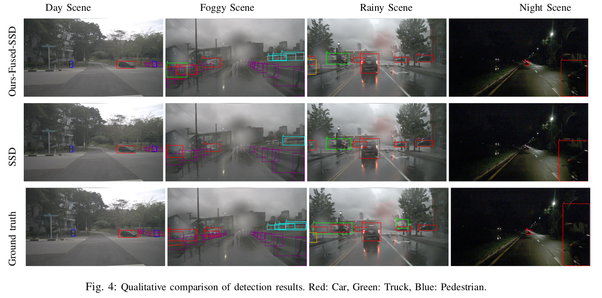

# Camera-Radar Fusion for Object Detection

Real-time camera-radar fusion model for autonomous vehicle perception using SSD with Bottleneck Attention Module (BAM).

## Results
# A. Qualitative result



# A. Quantitative result and comparison with other state-of-the-art models 
| Model | Backbone | wmAP | Inference | Device |
|-------|----------|------|-----------|--------|
| Camera-only SSD | ResNet-18 | **43.x** | **23ms (43 FPS)** | **Onlogic Karbon 804** |
| **Camera-Radar SSD-BAM** | **ResNet-18** | **46.x** | **28ms (35 FPS)** | **Onlogic Karbon 804** |

Evaluated on the NuScenes-derived dataset with 7 object classes.
## Architecture

```
Camera Image --> ResNet-18 Backbone --> Feature Maps (6 scales)
                                              |
                                        [Concat + 1x1 Conv]
                                              |
                                          BAM Attention
                                              |
Radar Image  --> ResNet-18 Backbone --> Feature Maps (6 scales)
                                              |
                                        SSD Detection Head
                                              |
                                      Boxes + Classes + Scores
```

The BAM module applies channel and spatial attention after fusing camera and radar features at each scale, allowing the network to learn which modality is more informative per region.

## Dataset Structure

```
data/
  train/
    camera_image/     # RGB images (e.g., frame_000001_cam.jpg)
    radar_image/      # Radar representations (e.g., frame_000001_radar.png)
    annotations/      # Pascal VOC format text files
  val/
    camera_image/
    radar_image/
    annotations/
```

## Usage

### Training
```bash
python -m tools.train --config config/voc.yaml
```

### Evaluation
```bash
python -m tools.infer --config config/voc.yaml
```

### Inference Time Measurement
```bash
python -m tools.infer --config config/voc.yaml --infer_time
```

The model supports both camera-radar fusion and camera-only modes. When radar input is omitted, the model runs with camera features only.

## Deployment

The trained model was deployed on GEM e6 and Lincoln MKZ autonomous vehicles:
- Exported from PyTorch to ONNX
- Optimized with TensorRT on Onlogic Karbon 804 edge computer
- Fallback chain: TensorRT -> CUDA -> CPU

See `docs/` for deployment details.

## Citation

If you use this work, please cite our IEEE ITSC 2024 paper.
T. Mengistu, T. Getahun and A. Karimoddini, "A Robust Radar-Camera Fusion for 2D Object Detection for Autonomous Driving," 2025 IEEE 28th International Conference on Intelligent Transportation Systems (ITSC), Gold Coast, Australia, 2025, pp. 2842-2847, doi: 10.1109/ITSC60802.2025.11423247. keywords: {Radar cross-sections;Attention mechanisms;Accuracy;Radar detection;Object detection;Radar imaging;Sensor fusion;Feature extraction;Cameras;Autonomous vehicles;Sensor fusion;feature-level fusion;object detection;autonomous driving},


## Vehicles

| Platform | Description |
|----------|-------------|
| GEM e6 | Low-speed autonomous shuttle |
| Lincoln MKZ | Highway-capable autonomous vehicle |

<!-- Add your setup photos in docs/images/ -->
